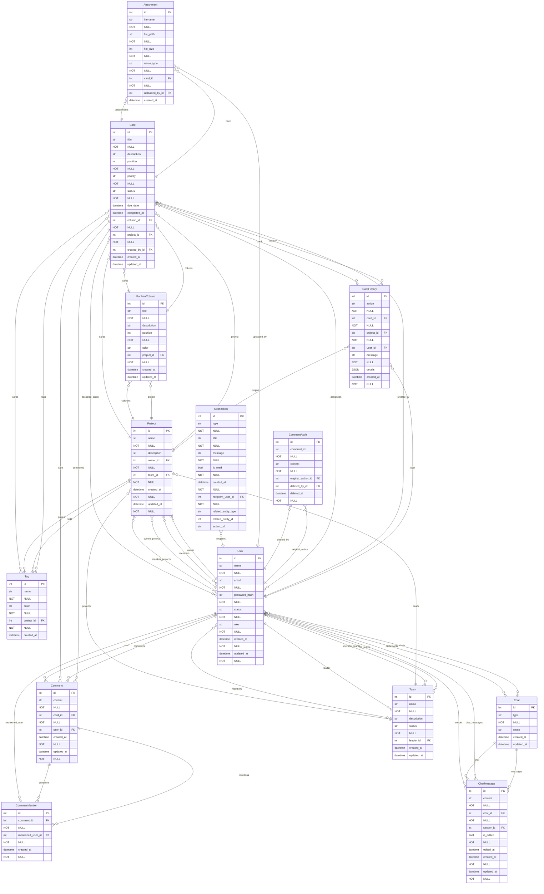

# Diagrama ER - Entidade-Relacionamento

*Gerado automaticamente em: 2025-11-17 06:59:51*

## Legenda

- **PK**: Primary Key (Chave Primária)
- **FK**: Foreign Key (Chave Estrangeira)
- **NOT NULL**: Campo obrigatório
- `||--o{`: Um para muitos (One-to-Many)
- `}o--||`: Muitos para um (Many-to-One)
- `}o--o{`: Muitos para muitos (Many-to-Many)
