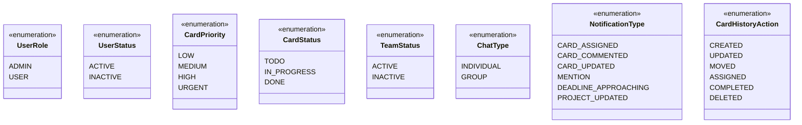

# UML Detailed Class Diagram

> **Note**: Este diagrama complementa o `uml-diagram.md` incluindo os métodos existentes nas classes do sistema.
>
> Geração manual - Última atualização: 2025-11-20

## Enums

## Notas sobre os Métodos

### Métodos Padrão (`__repr__`)
Todas as classes possuem o método `__repr__()` que retorna uma representação em string da instância para debugging.

### Classe Chat - Métodos de Negócio
A classe `Chat` possui a implementação mais rica de métodos:

- **Properties** (`is_individual`, `is_group`, `participant_count`): Fornecem informações computadas sobre o tipo e estado do chat
- **Métodos de consulta** (`get_participant_ids()`, `has_participant()`): Permitem verificar participantes
- **Métodos de formatação** (`get_chat_name_for_user()`): Retorna o nome apropriado do chat para cada usuário

### Classe Project
- `update_timestamp()`: Atualiza manualmente o campo `updated_at` (útil quando apenas relacionamentos mudam)

### Classe ChatHelpers (Utilitária)
Métodos estáticos para operações auxiliares relacionadas a chats:
- Geração de nomes para chats individuais
- Validação de nomes de grupos
- Formatação de listas de participantes
