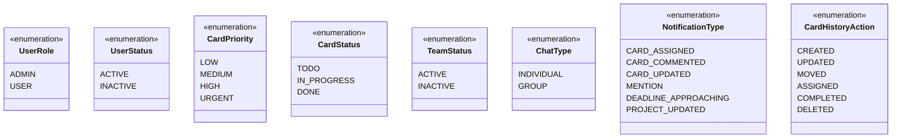

# UML Detailed Class Diagram

> **Note**: Este diagrama complementa o `uml-diagram.md` incluindo os métodos existentes nas classes do sistema.
>
> Geração manual - Última atualização: 2025-11-20

## Enums

## Notas sobre os Métodos

### Métodos Padrão (`__repr__`)
Todas as classes de entidade possuem o método `__repr__()` que retorna uma representação em string da instância para debugging.

### Classes de Serviço (Services)
As classes marcadas com `<<service>>` implementam a lógica de negócio e operações CRUD do sistema:

#### UserService
CRUD completo de usuários com operações especiais:
- Gerenciamento de roles (ADMIN/USER)
- Ativação/desativação de contas
- Alteração de senha com validações

#### TeamService
Gerenciamento de equipes:
- CRUD completo de teams
- Adição/remoção de membros
- Estatísticas de equipe

#### ProjectService
Gerenciamento de projetos:
- CRUD completo
- Controle de acesso (leitura/edição)
- Conversão para diferentes formatos de resposta

#### ColumnService
Gerenciamento de colunas Kanban:
- CRUD completo
- Reordenação de colunas
- Criação automática de colunas padrão

#### CardService
Gerenciamento de cards e tags:
- CRUD completo de cards
- Movimentação entre colunas
- Filtros avançados
- Gerenciamento de tags

#### CommentService
Gerenciamento de comentários:
- CRUD completo
- **Limite de edição: 2 minutos** (apenas autor pode editar/deletar)
- ADMIN pode sempre modificar

#### NotificationService
Sistema de notificações:
- CRUD completo
- Marcação individual/múltipla/todas como lidas
- Contagem de não lidas
- Estatísticas
- Limpeza de notificações lidas

#### AttachmentService
Gerenciamento de anexos:
- Upload/download de arquivos
- Integração com Cloudinary
- Informações de armazenamento por projeto

#### CardHistoryService
Rastreamento de mudanças:
- Registro automático de alterações em cards
- Histórico completo de ações

#### ChatService
Gerenciamento de chats:
- Criação de chats individuais e em grupo
- Adição/remoção de participantes
- Atualização de nome de grupo
- Marcação de leitura
- Cálculo de mensagens não lidas

#### ChatMessageService
Gerenciamento de mensagens:
- Envio/edição/exclusão de mensagens
- **Limite de edição: 10 minutos**
- Criação automática de notificações

#### AuthService
Autenticação e autorização:
- Registro de novos usuários
- Autenticação por email/senha
- Geração de tokens JWT

#### ReportService
Geração de relatórios e PDFs:
- Relatório de eficiência por usuário
- Relatório de projeto
- Relatório de eficiência de equipe
- Exportação em PDF de todos os relatórios
- Métricas de tarefas, tempo e prioridades

#### CloudinaryService
Gerenciamento de arquivos na nuvem:
- Upload de arquivos
- Exclusão de arquivos
- Geração de URLs públicas

### Classe Chat - Métodos de Negócio
A classe `Chat` possui a implementação mais rica de métodos em entidades:

- **Properties** (`is_individual`, `is_group`, `participant_count`): Fornecem informações computadas sobre o tipo e estado do chat
- **Métodos de consulta** (`get_participant_ids()`, `has_participant()`): Permitem verificar participantes
- **Métodos de formatação** (`get_chat_name_for_user()`): Retorna o nome apropriado do chat para cada usuário

### Classe Project
- `update_timestamp()`: Atualiza manualmente o campo `updated_at` (útil quando apenas relacionamentos mudam)

### Classe ChatHelpers (Utilitária)
Métodos estáticos para operações auxiliares relacionadas a chats:
- Geração de nomes para chats individuais
- Validação de nomes de grupos
- Formatação de listas de participantes

## Convenções de Nomenclatura

### Métodos Públicos vs Privados
- **Métodos públicos** (`+`): Interface pública do serviço, usada pelos controllers/routers
- **Métodos privados** (`-` com prefixo `_`): Lógica interna, helpers, não devem ser chamados externamente

### Métodos Estáticos
- Marcados com `$` após os parâmetros
- Não dependem de instância da classe
- Geralmente utilities ou helpers

### Constantes
- Definidas em UPPER_CASE
- Exemplo: `EDIT_TIME_LIMIT_MINUTES`

## Endpoints REST API

Cada Service possui endpoints correspondentes nos routers (`app/routers/`):

- **UserRouter**: `/api/users`
- **TeamRouter**: `/api/teams`
- **ProjectRouter**: `/api/projects`
- **ColumnRouter**: `/api/projects/{project_id}/columns`
- **CardRouter**: `/api/projects/{project_id}/cards`
- **CommentRouter**: `/api/projects/{project_id}/cards/{card_id}/comments`
- **NotificationRouter**: `/api/notifications`
- **AttachmentRouter**: `/api/projects/{project_id}/cards/{card_id}/attachments`
- **ChatRouter**: `/api/chats`
- **AuthRouter**: `/api/auth`
- **ReportRouter**: `/api/reports`
