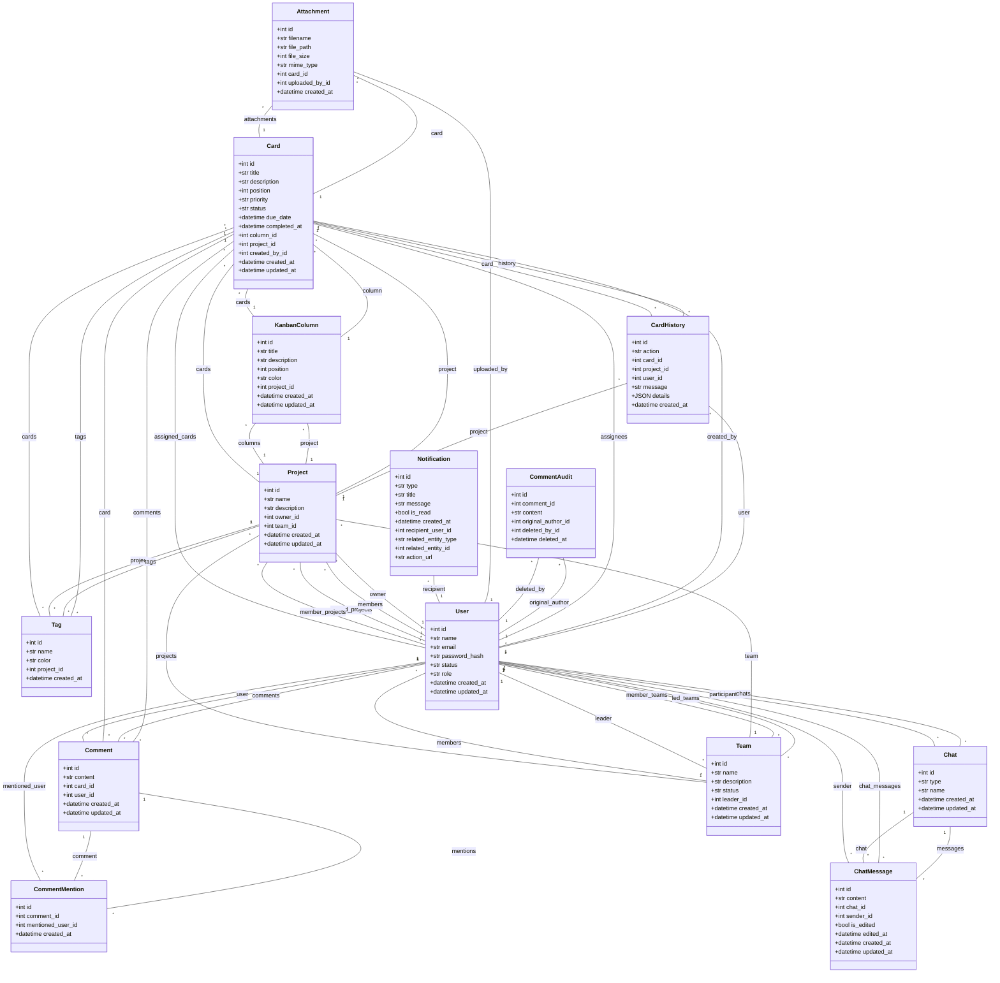

# Diagrama UML - Classes

*Gerado automaticamente em: 2025-11-17 06:59:51*

## Legenda

- `1 -- *`: Relacionamento um para muitos
- `* -- *`: Relacionamento muitos para muitos
- `+`: Atributo público
